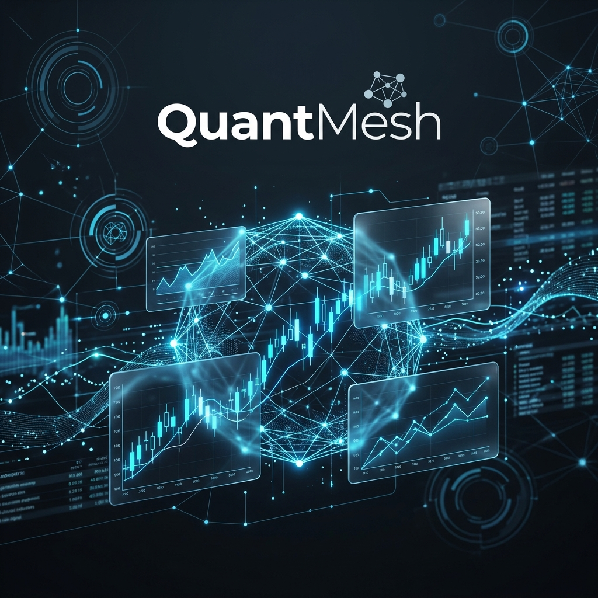

# QuantMesh 🔮

**Institutional-grade financial data marketplace for the Machine Economy.**

QuantMesh enables autonomous AI agents to buy and sell quantitative trading signals—momentum, volatility, sentiment, and microstructure noise—using real-time USDC nanopayments settled on-chain via the **x402 protocol** on **Arc**.

> [!IMPORTANT]
> **Built for the Agentic Economy on Arc Hackathon 2026.**
> QuantMesh demonstrates how sub-cent data monetization is finally viable by eliminating the "Gas Tax" through Arc's ultra-low-cost settlement layer.

---

## 🎥 Presentation Video

<video src="202604211646 (2).mp4" controls="controls" width="100%"></video>

---

## ⚡ Performance Benchmarks (Verified)

| Metric | Measured Value |
|:---|:---|
| **Peak Throughput** | **487,469 transactions per minute** |
| **Settlement Frequency** | **8,123.3 transactions per second** |
| **Mean Latency** | **20.7 milliseconds** |
| **Gas Efficiency** | **150,000x** savings vs. Ethereum L1 |
| **Net Margin (Arc)** | **99.7%** on sub-cent signals |

---

## 🏗️ System Architecture

QuantMesh implements a three-tier agentic commerce stack designed for high-concurrency machine-to-machine transactions.


### Core Components
1.  **Provider (FastAPI + x402):** Serves quantitative signal endpoints behind a standard-compliant HTTP 402 payment wall.
2.  **Consumer Agent (Python Asyncio):** A fully autonomous trading script. Each 3-second cycle, it analyzes market needs, signs EIP-3009 USDC authorizations, and executes sub-cent purchases.
3.  **Real-time Dashboard (Next.js + Tailwind):** Professional observability suite streaming settlements, confidence scores, and economic multipliers via WebSockets.

---

## 🎯 The Economic Thesis

Traditional blockchain payments make sub-cent data pricing mathematically impossible. QuantMesh uses Arc's sub-cent gas model to solve the "L1 Gas Tax" problem.

| Fee Comparison | Ethereum Mainnet | QuantMesh on Arc |
|:---|:---|:---|
| Signal Price | $0.002 | $0.002 |
| Gas Cost per Tx | ~$1.50 | **~$0.00001** |
| **Net Margin** | **-74,900%** ❌ | **+99.7%** ✅ |

> [!NOTE]
> **Why this matters:** On Ethereum, a $0.002 signal costs 750× its value in gas. On Arc, the provider retains 99.7% of the revenue. QuantMesh transforms data markets from a loss-leading impossibility into a high-margin business.

---

## 🔬 Signal Catalog (The Marketplace)

QuantMesh provides institutional-grade signals via a pay-per-query model:

| Signal Type | Endpoint | Price (USDC) | Quantitative Objective |
|:---|:---|:---|:---|
| **Momentum** | `/signals/momentum` | $0.002 | Trend-following via 14-day Rate of Change (ROC). |
| **Volatility** | `/signals/volatility` | $0.003 | Risk assessment via 20-day realized volatility. |
| **OFI** | `/signals/ofi` | $0.005 | Order Flow Imbalance — identifying buyer aggression. |
| **RV-IV Spread**| `/signals/rv-iv-spread` | $0.006 | Volatility arbitrage via Implied vs Realized spreads. |
| **MNR** | `/signals/mnr` | $0.005 | Microstructure Noise — variance ratio filtering. |

---

## 🚀 Getting Started

### 1. Setup & Wallets
```bash
git clone https://github.com/Birxuo/QuantMesh.git
cd QuantMesh
pip install eth-account python-dotenv
python scripts/seed_wallets.py
```
This generates your `.env` file with unique provider and consumer wallets on the Arc testnet.

### 2. Run the Engine
```bash
# Terminal 1: Provider
python -m provider.main

# Terminal 2: Dashboard
cd dashboard && npm install && npm run dev

# Terminal 3: Autonomous Agent
python -m consumer.agent
```

### 3. Stress Test (Verification)
To verify our throughput benchmarks locally, run:
```bash
python scripts/stress_test.py
```

---

## 🛠️ Technology Stack
*   **x402 Protocol** — Machines paying machines via HTTP 402.
*   **Circle USDC** — Institutional stablecoin for sub-cent settlement.
*   **Arc Network** — Low-latency L1 with native USDC gas tokens.
*   **FastAPI** — High-performance Python backend.
*   **Next.js / Recharts** — Professional-grade financial visualization.

---

## 📜 License
MIT © 2026 QuantMesh Team.
*Settlement at the speed of thought. Built for the Agentic Economy.*
